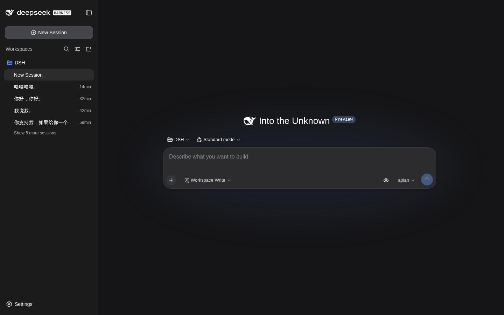
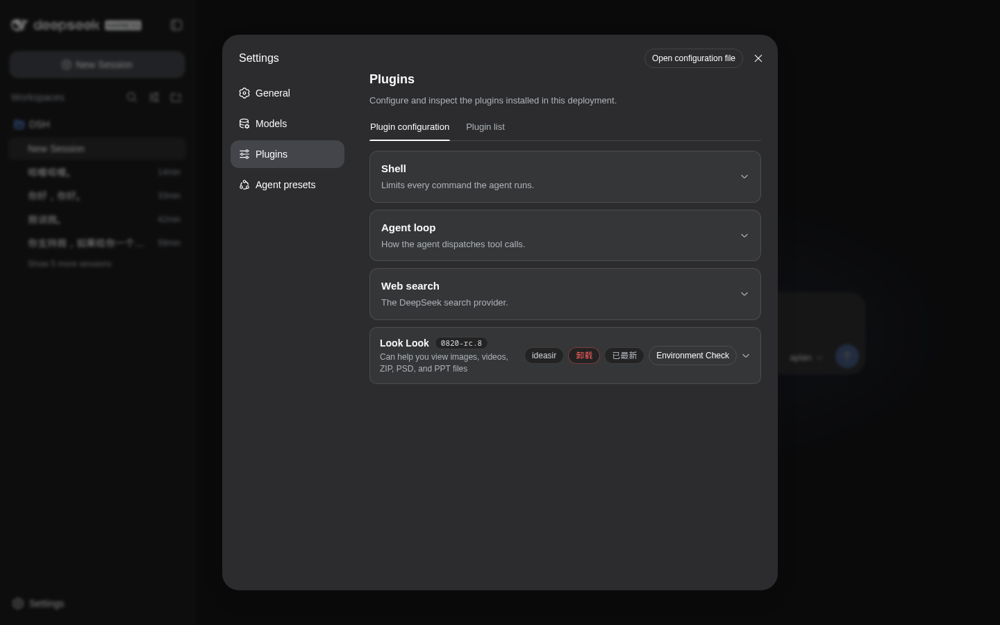
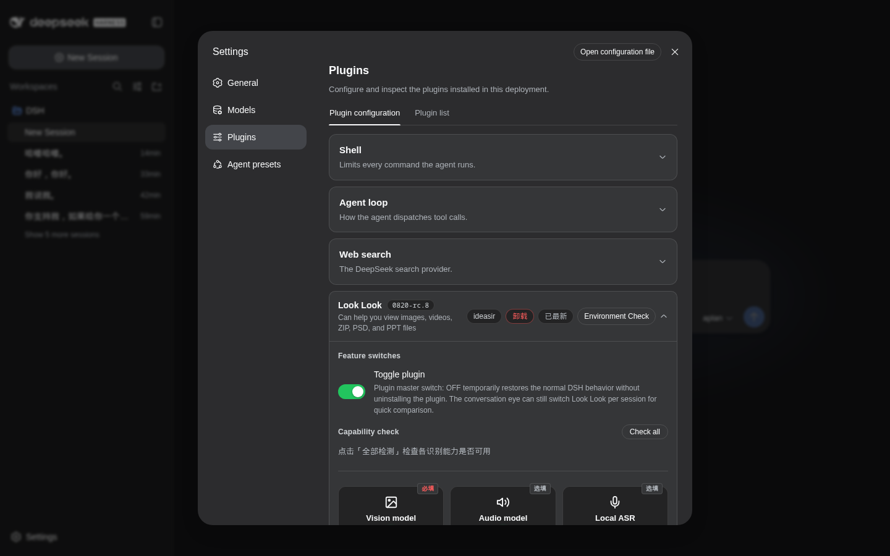

# Look Look

> 当前版本 `0821-rc.8`，适配 DSH `v0.1.0-rc.8`。使 DeepSeek Harness 的纯文本 Agent 具备图片、视频、音频、PSD、Office 文档、PDF、压缩包的理解能力。





## 安装方式

项目通过 DSH bundle 机制加载。在 DSH profile 的 `package.json` 中声明：

```bash
cd /path/to/dsh/profile
npm install --save /path/to/dsh-looklook
```

然后在 `package.json` 的 `dsh.profile.bundles` 中添加 `"dsh-looklook"`，重启 DSH 即可。

## 功能清单

### 图片理解
- 本地图片识别，调用用户配置的视觉模型
- 支持 PNG/JPG/JPEG/GIF/WebP/BMP/AVIF/SVG/PSD/TIFF/ICO/HEIC/HEIF/RAW
- 纯文本模型通过 `.uploads/` 文件通道查看图片
- 原生多模态模型走原生图片管线
- 上传时在输入框显示本地缩略图 + 拖拽/粘贴/按钮上传

### 视频理解
- 本地视频：元信息读取、场景驱动抽帧、画面识别、字幕提取、音频提取、对白转写、语气/音乐/节奏理解、时间轴整理
- 视频链接：B站、YouTube、抖音、西瓜视频、腾讯视频、yt-dlp 支持的平台
- 缩略图 + 点击播放弹窗

### 音频理解
- 音频文件转写（MP3/WAV/FLAC/AAC/OGG/M4A/WMA）
- 视频音频提取 + 对白转写
- 可选本地 ASR（faster-whisper，tiny~large-v3）

### 文档解析
- PPT/PPTX：幻灯片文字、图形、备注、图片、页面结构
- PDF：页面文字 + 扫描页图片理解
- Word/DOCX：段落、标题、表格、嵌入图片
- Excel/XLSX：工作表、单元格、表格、日期数据
- PSD：画布宽高、分辨率、色彩模式、图层树、文字图层、合成预览
- ZIP：目录结构、按需分析、仅用户要求才解压

### 文件上传通道
- 所有文件类型均可上传（图片/视频/压缩包/文档/音频/代码）
- 输入框预览：图片缩略图、视频缩略图、文件类型图标（Tabler Icons）
- 环形进度条 + 百分比
- 原始文件名 + 服务端哈希名分离存储（防同名覆盖）
- 排队气泡不泄露 JSON 标记

### 用户消息渲染
- 图片：缩略图 + 灯箱（ImageLightbox）
- 视频：缩略图 + 播放弹窗（VideoPlayer）
- 其他文件：图标 + 文件名 + 大小

### 设置面板
- 主开关（整个插件开关）
- 视觉模型配置（必填）+ 模型发现 + 测试
- 音频模型配置（选填）+ 本地 ASR 安装
- 环境检测 + 能力检测
- 版本检查 + 更新检测 + 一键卸载

### 会话级小眼睛开关
- 工具栏小眼睛，按会话切换视觉增强
- 开启时 Look Look 接管图片/视频
- 关闭时退回原生模型处理

### ChatMinimap 导航概览标尺
- 对话区左侧显示用户消息横杠
- 从 React store（ConversationRoot.nodes）读取完整消息列表，不受虚拟滚动影响
- 悬停预览 + 点击跳转 + 深色/浅色主题自适应
- 切换会话实时重建

### 复制会话 ID
- assistant-actions 槽位按钮，一键复制 `dsh-session://` 链接到剪贴板

## 项目架构

```
dsh-looklook/
├── src/
│   ├── index.ts              # 服务端入口：注册 RPC 工具（looklook_see/process_zip/ffmpeg/ASR）
│   ├── remote.ts             # 文件上传/读取/设置/凭据/环境检测 RPC 端点
│   ├── client/
│   │   ├── index.ts          # 客户端入口：RPC 注册、submit patch、fileRegistry、槽位注册
│   │   ├── UserMessageNodeView.tsx  # 用户消息渲染（图片/视频/文件卡）
│   │   ├── FileChips.tsx     # 输入框文件预览（缩略图/进度条/删除）
│   │   ├── FileTypeIcon.tsx  # 文件类型图标（Tabler + SVG 文字标签）
│   │   ├── ChatMinimap.ts    # 导航概览标尺（纯 DOM）
│   │   ├── CopySessionIdButton.tsx  # 复制会话 ID 按钮
│   │   ├── PluginTab.tsx     # 插件设置面板主卡片
│   │   ├── VisionSettings.tsx  # 视觉/音频模型设置
│   │   ├── ProviderListEditor.tsx  # 提供商列表编辑器
│   │   ├── Features.tsx      # 功能开关
│   │   ├── Features.tsx      # 功能检测区域
│   │   ├── EnvCheck.tsx      # 环境检测弹窗
│   │   ├── VisionToggle.tsx  # 小眼睛 SVG
│   │   ├── lightbox.tsx      # 图片灯箱
│   │   ├── video-player.tsx  # 视频播放器
│   │   ├── eye-controller.ts  # 小眼睛状态控制器
│   │   ├── feature-controller.ts # 主开关控制器
│   │   ├── pending-files.ts  # 待发送文件管理
│   │   ├── upload-shared.ts  # 上传逻辑 + formatSize
│   │   ├── bind-snapshot.ts  # 自建 bindSnapshotSelector（DSH rc.8 不再导出）
│   │   ├── plugin-settings.ts  # 插件设置接口类型
│   │   ├── settings-view.ts  # 设置视图工具
│   │   └── locales.ts        # 国际化（zh/en）
│   ├── upload.ts             # 服务端上传 + 文件名时间戳
│   ├── looklook-skill.ts     # AI 工具提示（告诉 Agent 用 [f:xxx] 做 source）
│   ├── see-tool.ts           # looklook_see 工具主逻辑
│   ├── video-tool.ts         # 视频处理工具
│   ├── describe-tool.ts      # 图片描述
│   ├── doc-tool.ts           # 文档解析工具
│   ├── translate.ts          # 翻译工具
│   ├── vision-client.ts      # 视觉 API 客户端
│   ├── zip-store.ts          # 压缩包缓存
│   ├── zip-tool.ts           # 解压工具
│   ├── ffmpeg.ts             # FFmpeg 封装
│   ├── asr-install.ts        # 本地 ASR 安装
│   ├── capability-check.ts   # 能力检测
│   ├── env-check.ts          # 环境检测
│   ├── python-env.ts         # Python 环境管理
│   ├── ref.ts                # 文件引用
│   ├── settings.ts           # 设置管理
│   ├── types.ts              # 类型定义
│   └── parser/               # 文档解析器
│       ├── index.ts          # 解析器路由
│       ├── pdf.ts / pdf-worker.mjs / pdf-types.ts
│       ├── docx.ts / pptx.ts / xlsx.ts
│       ├── psd.ts / psd-types.ts
│       ├── package.ts        # 压缩包解析
│       └── xml.ts
├── tests/                    # 验证测试
├── scripts/                  # 构建脚本 + 视频 worker
├── skills/                   # looklook-skill 技能文件
└── cordis.patch.yml          # DSH 插件配置
```

## 设计原则

### 与 DSH 核心解耦
- 不修改任何 `@deepseek-ai/*` 源码
- 缺失的组件（bindSnapshotSelector、ImageLightbox）在插件内自建
- 使用 DSH 槽位系统注册 UI，不劫持原生渲染
- 文件上传走独立 RPC 通道，不碰原生附件管线

### 文件命名规范
- 服务端文件名：`原始文件名_时间戳.扩展名`（`Date.now().toString()` 十进制）
- 原始文件名 ≠ 服务端名，两者分离存储
- `fileRegistry` 以原始文件名做 key，服务端名存 value

### 排队气泡防泄漏
- draft 中不放 JSON 标记
- 格式：`[图片]原始文件名 (大小) [f:服务端哈希名]`
- 元数据存在全局 `fileRegistry` Map 中，渲染时查表

### 虚拟滚动兼容
- DSH 使用虚拟滚动，DOM 中最多 6 个节点
- ChatMinimap 从 React store 直接读取消息列表
- MutationObserver 监听 body 变化，实时响应

### 图标策略
- 所有 SVG 硬编码，零 CDN 依赖
- Tabler Icons 用于有专属图标的扩展名
- 通用文件轮廓 + SVG `<text>` 标签处理无专属图标的扩展名

## 构建与部署

```bash
# 构建
npm run build

# 部署（必须 build 后才 cp）
cp -r lib/ /path/to/dsh/profile/node_modules/dsh-looklook/

# 重启 DSH
kill -9 $(ss -tlnp | grep 3080 | grep -oP 'pid=\K[0-9]+')
cd /path/to/dsh/profile && npx dsh --profile web --port 3080 --no-open

# 浏览器必须硬刷新（Ctrl+Shift+R）
```

## 版本历史

详见 [CHANGELOG.md](./CHANGELOG.md)。核心版本对应：

| 版本 | DSH 版本 | 日期 | 主要变更 |
|------|----------|------|----------|
| 0821-rc.8 | v0.1.0-rc.8 | 2026-08-20 | ChatMinimap、CopySessionId、主题自适应、文件上传十进制时间戳、排队气泡修复 |
| 0.3.0 | v0.1.0-rc.7 | 2026-08-19 | 升级 rc.7 适配、PPT 音频修复 |
| 0.2.1 | v0.1.0-rc.6 | 2026-08-17 | 文件上传通道、消息渲染、设置面板、小眼睛 |